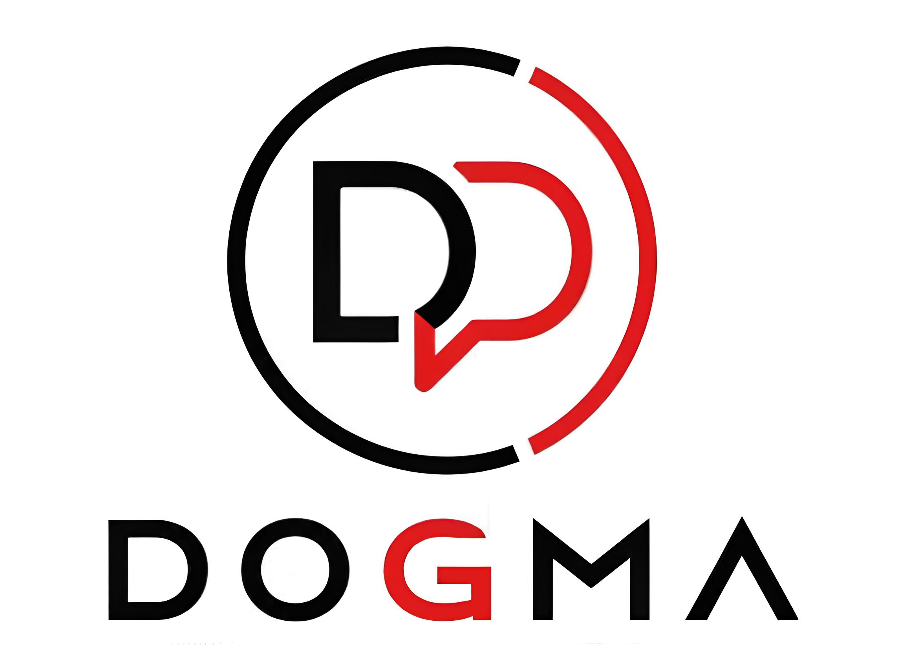

<p align="center">
  
  <h2 align="center">Diskusi Obrolan Gerakan Bersama</h2>
</p>

<p align="center">
<a href="http://dogma.gt.tc/"></a>
<a href="https://github.com/mochamaddapa/dogma-web"></a>
<a href="https://github.com/mochamaddapa/dogma-web"></a>
</p>


## Tentang DOGMA

DOGMA (Diskusi Obrolan Gerakan Bersama) adalah sebuah platform profil komunitas berbasis web dengan desain yang ekspresif dan minimalis. Kami percaya bahwa sebuah diskusi harus menjadi pengalaman yang menyenangkan, objektif, dan edukatif. DOGMA mempermudah pengelolaan informasi komunitas dengan menyederhanakan berbagai kebutuhan, seperti:

- [Tampilan landing page yang cepat dan modern](http://dogma.gt.tc/) untuk profil pergerakan.
- Manajemen topik dan jadwal diskusi yang dinamis.
- Desain *mobile-first* yang responsif menggunakan Tailwind CSS.
- Integrasi langsung dengan WhatsApp untuk pendaftaran anggota.
- Optimasi aset dan *routing* agar ringan berjalan di *shared hosting*.

DOGMA dirancang agar mudah diakses, tangguh, dan menyediakan alat digital yang dibutuhkan untuk mengembangkan ruang diskusi dan pergerakan.

## Akses Demo

Anda dapat melihat langsung web aplikasi DOGMA yang sudah mengudara melalui tautan berikut:

👉 **[Live Demo Website DOGMA](http://dogma.gt.tc/)**


## Memulai Instalasi

Jika Anda ingin menjalankan atau mengembangkan platform web DOGMA di komputer lokal (*localhost*), *clone repository* ini dan instal seluruh dependensinya melalui langkah berikut:
```bash

composer install
npm install && npm run build
cp .env.example .env
php artisan key:generate
php artisan migrate
php artisan serve

Mitra Komunitas
Kami ingin menyampaikan rasa terima kasih kepada para mitra yang telah mendukung pergerakan DOGMA serta menyediakan ruang bagi ide-ide kami untuk terus tumbuh.

Mitra Utama
Mahasiswa, Akademisi & Pekerja

Kontribusi
Terima kasih telah mempertimbangkan untuk berkontribusi pada platform web DOGMA! Baik Anda seorang developer, akademisi, maupun pekerja yang peduli terhadap edukasi, kontribusi Anda terhadap kode maupun komunitas kami sangatlah berharga.

Pelaporan Celah Keamanan
Jika Anda menemukan celah keamanan di dalam platform web DOGMA, silakan hubungi tim administrasi kami secara langsung melalui kontak yang tersedia di website. Setiap laporan akan segera kami tangani.
